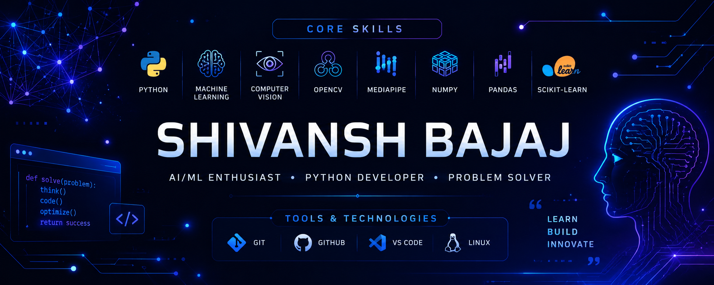

<div align="center">



# Shivansh Bajaj

### AI • Machine Learning • Computer Vision


<p>

<a href="https://github.com/Shivanshbajaj1">

</a>

<a href="https://www.linkedin.com/in/shivansh-bajaj-a433b7371/">

</a>

<a href="mailto:shivanshbajaj276@gmail.com">

</a>

<a href="https://leetcode.com/u/ShivanshBajaj1/">

</a>

</p>


</div>

---

# 🚀 About Me

```text
👨‍💻 Name        : Shivansh Bajaj
🎓 Degree      : B.Tech CSE (AI & ML)
🧠 Focus       : Artificial Intelligence & Computer Vision
💻 Languages   : Python • Java • C
🌱 Learning    : AWS • Backend • DSA
🎯 Goal        : AI/ML Engineer
```

I'm passionate about building intelligent software that solves real-world problems through Artificial Intelligence and Machine Learning.

Currently, I'm focused on Computer Vision, Backend Development, and Cloud technologies while continuously improving my software engineering skills through projects and hands-on learning.

---

# 🎯 2026 Focus

- 🚀 Build **Orbit** into a production-ready productivity platform
- 🤖 Develop impactful AI & Machine Learning applications
- 💻 Solve **300+ LeetCode** problems
- 🌍 Contribute to Open Source
- 💼 Secure my first AI/ML Internship

---

# ⚙️ Tech Stack

### Languages & Tools

<p align="center">


</p>

### AI & Machine Learning

<p align="center">


</p>

---

# 🚀 Featured Projects

<table>
<tr>
<td width="50%">

## 🌌 Orbit *(In Development)*

> **AI-powered Productivity Platform** designed for students and developers.

### ✨ Planned Features

- 📅 Smart Task Management
- 🎯 XP & Achievement System
- 📚 Learning Resources
- 🤖 AI Recommendations
- 📊 Progress Analytics
- 📝 Notes & Attachments

### 🛠️ Tech Stack

`Python` `FastAPI` `SQLite` `HTML` `CSS`

🔗 **Repository:** *Coming Soon*

</td>

<td width="50%">


</td>
</tr>
</table>

---

<table>
<tr>

<td width="50%">

## 🎮 AI Gesture Control

Control your computer using hand gestures powered by **OpenCV** and **MediaPipe**.

### ✨ Features

- 🖐️ Hand Gesture Recognition
- 📂 Open Applications
- 🔊 Volume Control
- 📸 Screenshot Capture
- 📄 Presentation Navigation
- 🔆 Brightness Control

### 🛠️ Tech Stack

`Python` `OpenCV` `MediaPipe`

🔗 **Repository**

https://github.com/Shivanshbajaj1/AI-Gesture-Control-Slides

</td>

<td width="50%">


</td>

</tr>
</table>

---

<table>
<tr>

<td width="50%">

## 💳 Credit Risk Prediction

Machine Learning model for predicting customer creditworthiness.

### Highlights

- 📊 Data Analysis
- 🤖 Classification Models
- 📈 Performance Evaluation
- 📉 Data Visualization

### Tech Stack

`Python`

`Scikit-learn`

`Pandas`

`NumPy`

</td>

<td width="50%">


</td>

</tr>
</table>

---

<table>
<tr>

<td width="50%">

## 🏠 House Price Predictor

Regression model that predicts housing prices using Machine Learning.

### Highlights

- Data Cleaning
- Feature Engineering
- Regression Algorithms
- Model Evaluation

### Tech Stack

`Python`

`Scikit-learn`

`Pandas`

</td>

<td width="50%">


</td>

</tr>
</table>

---

<table>
<tr>

<td width="50%">

## ☁️ AWS Labs

Hands-on AWS Cloud Practitioner labs and cloud learning projects.

### Topics

- EC2
- S3
- IAM
- VPC
- CloudWatch

</td>

<td width="50%">


</td>

</tr>
</table>

---

<table>
<tr>

<td width="50%">

## 🌐 Portfolio Website

Personal portfolio showcasing projects, skills, certifications and experience.

### Built With

- HTML
- CSS
- JavaScript

</td>

<td width="50%">


</td>

</tr>
</table>

---

# 📊 Developer Dashboard

# 📊 GitHub Analytics

<div align="center">


</div>

<br>

<div align="center">


</div>

<br>

<div align="center">


</div>

---

# 📈 GitHub Metrics

<div align="center">


</div>

---

# 🐍 Contribution Snake

<div align="center">


</div>

---

# 🏆 GitHub Highlights

<div align="center">

| 🚀 Focus | 📊 Status |
|:---------|:---------:|
| Artificial Intelligence | ✅ |
| Machine Learning | ✅ |
| Computer Vision | ✅ |
| Python Development | ✅ |
| AWS Cloud | 🚧 |
| Open Source | 🚧 |
| Backend Development | 🚧 |

</div>

---

# 🌐 Coding Profiles

<div align="center">

<a href="https://github.com/Shivanshbajaj1">

</a>

<a href="https://leetcode.com/u/ShivanshBajaj1/">

</a>

<a href="https://www.linkedin.com/in/shivansh-bajaj-a433b7371/">

</a>

<a href="mailto:shivanshbajaj276@gmail.com">

</a>

</div>

---

# 💡 Current Focus

```text
🧠 Artificial Intelligence
████████████████████ 100%

🤖 Machine Learning
█████████████████░░░ 85%

👁️ Computer Vision
████████████████░░░░ 80%

☁️ AWS Cloud
███████████░░░░░░░░░ 55%

💻 Data Structures & Algorithms
█████████████░░░░░░░ 65%

⚙️ Backend Development
██████████░░░░░░░░░░ 50%
```

---

# 📜 Certifications & Learning

### ☁️ Cloud

- AWS Cloud Practitioner (CLF-C02) Learning Journey
- AWS Hands-on Labs

### 🤖 Artificial Intelligence

- Machine Learning
- Computer Vision
- Data Analysis

### 💻 Software Development

- Data Structures & Algorithms
- Backend Development
- Git & GitHub

---

# 🌱 Currently Exploring

<div align="center">

| 🧠 AI & ML | ☁️ Cloud | 💻 Development |
|:----------:|:--------:|:--------------:|
| Machine Learning | AWS Cloud | Backend Development |
| Deep Learning | Docker | Data Structures & Algorithms |
| Computer Vision | Linux | System Design Fundamentals |

</div>

---

# 🎯 2026 Roadmap

<div align="center">

| Goal | Progress |
|:-----|:-------:|
| 🚀 Launch Orbit v1 | ⏳ In Progress |
| 💻 Solve 300+ LeetCode Problems | ⏳ In Progress |
| 🤖 Build 5 AI/ML Projects | ⏳ In Progress |
| ☁️ Strengthen AWS Cloud Skills | ⏳ In Progress |
| 🌍 Contribute to Open Source | 🎯 Planned |
| 💼 Secure an AI/ML Internship | 🎯 Target |

</div>

---

# 📊 Beyond Coding

<div align="center">

| 🌟 What Drives Me |
|:------------------|
| 🤖 Building AI solutions for real-world problems |
| 📚 Learning something new every day |
| 🚀 Turning ideas into practical software |
| 🌍 Contributing to the developer community |

</div>

---

# 🤝 Let's Connect

<div align="center">

<a href="mailto:shivanshbajaj276@gmail.com">

</a>

<a href="https://www.linkedin.com/in/shivansh-bajaj-a433b7371/">

</a>

<a href="https://github.com/Shivanshbajaj1">

</a>

<a href="https://leetcode.com/u/ShivanshBajaj1/">

</a>

</div>

---

# 💬 Favorite Quote

<div align="center">

> **"The best way to predict the future is to build it."**

</div>

---

# 📈 Profile Summary

```text
👨‍💻 AI & Machine Learning Enthusiast

🧠 Passionate about Computer Vision

💻 Building intelligent software with Python

☁️ Exploring Cloud Technologies

🚀 Always Learning. Always Building.
```

---

<div align="center">

## ⭐ Thanks for Visiting!

If you like my work or found something interesting,

consider ⭐ starring a repository or connecting with me on LinkedIn.

### 🚀 Learn • Build • Innovate • Repeat

<br>


</div>
